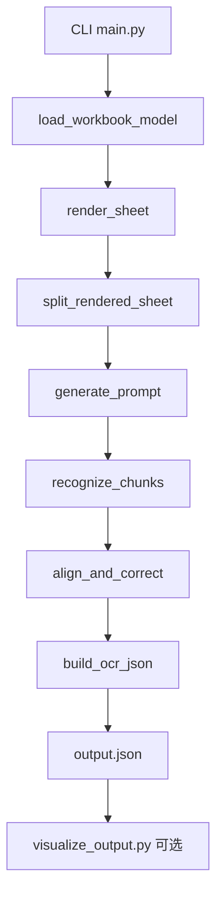
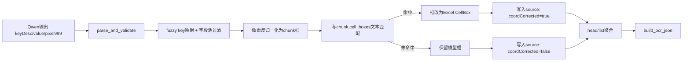

# Excel 报关单处理流水线详解（`jyk/excel_decl_pipeline`）

## 1. 目标与边界

`excel_decl_pipeline` 的目标是把报关单 Excel（`.xls/.xlsx`）转换成 OCR 兼容结构化 JSON，并在输出中给出可追溯的字段坐标。

覆盖能力：

1. 读取多 Sheet（仅可见 Sheet）。
2. 自动裁剪有效区域（去空白边缘）。
3. AutoFit 渲染，尽量保证单元格文本完整显示。
4. 超大图按 Excel 行/列边界切块（非像素硬切）。
5. 调用 Qwen3-VL 对每个块识别。
6. 使用 Excel 原始单元格文本进行字段比对、坐标纠偏。
7. 输出 `preDecHead/preDecList/operateImage/preDecContainer` 兼容 JSON。
8. 提供可视化脚本将输出框画回图片。

不做的事情：

1. 不做批量目录扫描（当前是单文件输入）。
2. 不回写 Excel。
3. 不保证模型一定能识别出所有字段（保留 `model_only` 兜底）。

## 2. 代码入口与模块索引

核心入口与模块：

1. `main.py`
2. `excel_loader.py`
3. `renderer.py`
4. `splitter.py`
5. `qwen_client.py`
6. `aligner.py`
7. `output_builder.py`
8. `models.py`
9. `field_mapping_loader.py`
10. `prompt_adapter.py`
11. `json_utils.py`
12. `visualize_output.py`
13. `tests/test_pipeline.py`

## 3. 端到端处理流程

### 3.1 模块级调用链（文字版）

`main.run_pipeline_async`  
→ `excel_loader.load_workbook_model`（读取+裁剪）  
→ `main._build_chunks`  
→ `renderer.render_sheet`（AutoFit + 渲染 + cell->pixel 映射）  
→ `splitter.split_rendered_sheet`（行/列边界分块 + chunk cell 映射）  
→ `prompt_adapter.generate_prompt`  
→ `qwen_client.recognize_chunks`（并发调用模型）  
→ `aligner.align_and_correct`（文本比对 + 坐标纠偏 + 行聚合）  
→ `output_builder.build_ocr_json`（OCR 兼容结构落盘）

### 3.2 Mermaid 主流程图



## 4. 数据模型与字段流转

数据类定义在 `models.py`。

1. `CellModel`：Excel 网格语义单元（含合并跨度、是否 merged child）。
2. `SheetModel`：裁剪后的 sheet（`cells` + 行高 + 列宽）。
3. `RenderedSheet`：渲染后整图 + `cell_boxes`（整图坐标系）。
4. `Chunk`：分图块（块图像、块偏移、块内 cell_boxes、row/col 范围）。
5. `RecognizedField`：模型识别出的单字段（`keyDesc/value/pixel[0..999]`）。
6. `ChunkExtraction`：单块识别结果（`pre_dec_head/pre_dec_list`）。

关键坐标系：

1. 模型坐标：`pixel=[x1,y1,x2,y2]`，归一化 0~999。
2. 块坐标：`axisX/axisY/width/height`，相对 chunk 图片左上角。
3. 整表坐标：块坐标 + `operateImage.offsetX/offsetY` 可回推。
4. 行列锚点：`row/col` 是“裁剪后 Sheet 的索引”，不是 Excel 原始绝对行号。

## 5. 各阶段原理与实现细节

### 5.1 CLI 与配置解析

文件：`main.py`

关键函数：

1. `_load_dotenv_files`：尝试多个 `.env` 路径自动注入环境变量。
2. `_load_api_key_from_settings`：回退读取 `customs_ocr/config/settings.py` 中 `API_KEY`。
3. `_resolve_api_key`：优先 `DASHSCOPE_API_KEY`，其次 `API_KEY`，再走 settings 回退。
4. `run_pipeline_async`：总编排函数。
5. `run_pipeline`：同步包装，便于普通脚本调用。
6. `parse_args/main`：CLI 入参解析与启动。

你之前碰到的两个典型报错都来自这里：

1. 相对导入报错：直接 `python main.py` 时没有包上下文，代码已通过 `if __package__ in (None, "")` 加了 fallback 导入。
2. API key 报错：环境变量未进入当前进程时，`_resolve_api_key` 会继续尝试 `.env` 和 settings 回退。

### 5.2 Excel 读取与有效区域裁剪

文件：`excel_loader.py`

核心原理：

1. 格式分流：`load_workbook_model` 按后缀走 `_load_xlsx` 或 `_load_xls`。
2. 可见 Sheet 过滤：隐藏 Sheet 跳过。
3. 合并单元格语义保留：构建 `merge_map`，主格保留跨度，子格标记 `is_merged_child=True`。
4. 尺寸标准化：行高 point->px，列宽字符宽->px，提供基础渲染几何。
5. 有效区域裁剪：`_trim_to_used_area` 用“非空且非 merged child”单元确定外接矩形，裁掉外围全空白。

注意：

1. 裁剪后 `row/col` 重新从 0 开始。
2. 空 Sheet 或全空可见 Sheet 会被跳过。
3. `.xls` 走 `xlrd`，并做日期/数值文本化。

### 5.3 渲染与 AutoFit（完整显示优先）

文件：`renderer.py`

核心原理是两阶段 AutoFit：

1. 列扩展（Pass 1）：按内容最大行宽估算所需宽度，若不足就把增量分摊到跨度列。
2. 行扩展（Pass 2）：按换行后行数与行高估算所需高度，不足则分摊到跨度行。

渲染时：

1. 只画非 merged child 单元格。
2. 每格画边框、文本（按宽度换行）。
3. 为有文本的主格记录 `CellBox`（坐标、尺寸、row/col/span、text）。

结果：

1. 得到整张 sheet 图。
2. 得到“单元格文本到像素框”映射，为后续纠偏提供基准。

### 5.4 分图（按 Excel 网格边界）

文件：`splitter.py`

关键点：

1. `_build_segments` 按行高/列宽累计分段，切点只落在行列边界。
2. `split_rendered_sheet` 对 row segment × col segment 做网格笛卡尔切块。
3. 每块都保存：`chunk_id/image_id/sheet_name/row_range/col_range/offset/width/height/image_path`。
4. cell 映射同步切分：对每个整图 `CellBox` 与块 bbox 做相交裁剪，映射成块内 `CellBox`。

这保证：

1. 切块后的坐标仍能对齐 Excel 网格。
2. 不用像素硬切破坏结构语义。

### 5.5 Qwen3-VL 识别与结果解析

文件：`qwen_client.py`

相关依赖：

1. prompt 生成：`prompt_adapter.py`
2. 字段池映射：`field_mapping_loader.py`
3. JSON 清洗解析：`json_utils.py`

流程：

1. `generate_prompt(att_type_code)` 生成字段池约束 prompt。
2. `recognize_chunks` 并发调用 `_recognize_single_chunk`。
3. 每块请求模型输入：`image_data_url + prompt`。
4. `parse_and_validate` 处理 markdown 包裹、提取 JSON、结构校验。
5. `fuzzy_match_key_desc` 把 `keyDesc` 规范到内部 `key`。
6. `pixel` 归一化到合法 0~999。
7. 只保留在字段池允许范围内的字段。

### 5.6 交叉验证与坐标纠偏（核心）

文件：`aligner.py`

这是核心算法，拆成 8 步：

1. 模型框反归一化：`_model_bbox_to_chunk_bbox` 把 0~999 坐标转成 chunk 像素框。
2. 文本标准化：`normalize_text` 做 NFKC、去空白、小写、数字归一（例如 `1.0` 和 `1` 对齐）。
3. 候选检索：`_match_candidates` 在当前 chunk 的 `cell_boxes` 里按顺序找：`exact -> normalized -> weak(包含关系)`。
4. 候选歧义消解：若同值候选多个，取“离模型框中心最近”的单元格。
5. 坐标纠偏：匹配成功用 Excel `CellBox`；匹配失败保留模型框（`model_only`）。
6. 值纠偏：匹配成功时，`final_value` 替换为 Excel 单元格文本，抑制 OCR 轻微误读。
7. 行列锚点解析：`_resolve_row_col` 优先匹配格 `row/col`；没匹配则按模型框中心落点反推；若有 `model_row_index` 则约束行索引。
8. 聚合：`_aggregate_head` 做表头去重合并；`_aggregate_list` 优先 `codeTs` 作行锚，无锚时按最近锚归属。

纠偏结果元数据（写入 source）：

1. `matchLevel`: `exact/normalized/weak/model_only`
2. `coordCorrected`: 是否用 Excel 框替换了模型框

### 5.7 输出构建（OCR 兼容）

文件：`output_builder.py`

输出主体：

1. `content.preDecHead`
2. `content.preDecList`
3. `content.preDecContainer`
4. `content.operateImage`

关键实现：

1. `_transform_source`：把内部 source 映射成兼容字段名（`axisX/axisY/width/height/imageId/attTypeCode` 等）。
2. `_transform_field_item`：字段层包装。
3. `_build_operate_image`：写入 chunk 追溯元信息（sheet/rowRange/colRange/offset/chunkId）。
4. `build_ocr_json`：组装最终 `head + content`。

坐标追溯公式：

`sheet_x = axisX + offsetX`  
`sheet_y = axisY + offsetY`

其中 `offsetX/offsetY` 来自 `operateImage` 对应 `imageId`。

## 6. 字段生命周期图（模型框 -> 纠偏 -> 输出）



## 7. 可视化与测试说明

### 7.1 可视化脚本

文件：`visualize_output.py`

能力：

1. 读取 `output.json`。
2. 用 `operateImage.imageUrl` 建立 `imageId -> 图片路径`。
3. 遍历 `preDecHead/preDecList/preDecContainer` 的 `sourceList`。
4. 画框并打标签，附 `matchLevel` 与 `[C]/[M]` 标识。
5. 导出 `*_viz.png`。

标识含义：

1. `[C]`：坐标已纠偏到 Excel。
2. `[M]`：仍使用模型框。
3. `matchLevel`：文本匹配强度。

### 7.2 测试用例

文件：`tests/test_pipeline.py`

已覆盖：

1. 分图边界约束：所有 chunk 宽高不超过 `max_side`。
2. 纠偏优先策略：识别值与单元格一致时，坐标应回到单元格框。

## 8. 常见问题与定位

1. `ImportError: attempted relative import with no known parent package`  
原因：直接脚本运行触发相对导入问题。  
建议：`python -m jyk.excel_decl_pipeline.main ...`，或保持当前兼容逻辑并从仓库根运行。

2. `Missing API key...`  
原因：环境变量未在当前进程可见。  
定位：检查 `echo $env:DASHSCOPE_API_KEY`（PowerShell）和 `.env` 加载路径。  
当前实现也支持从 settings.py 回退读取。

3. 图片路径找不到导致可视化跳过  
原因：`operateImage.imageUrl` 是相对路径或文件被移动。  
定位：检查 `output.json` 中 `imageUrl` 与当前目录关系。

4. 字段匹配错位  
原因：同值文本在多个单元格重复，最近中心点策略可能选到邻近格。  
定位：看 `matchLevel` 与 `coordCorrected`，并在可视化图上核验。

## 9. 运行方式（推荐）

从仓库根目录执行：

```bash
python -m jyk.excel_decl_pipeline.main \
  --excel_path "D:\code\YiBao\jyk\transition\files\excel\W6787UA0161.xls" \
  --att_type_code 4 \
  --output_json "D:\code\YiBao\jyk\excel_decl_pipeline\output.json"
```

可视化：

```bash
python -m jyk.excel_decl_pipeline.visualize_output \
  --output_json "D:\code\YiBao\jyk\excel_decl_pipeline\output.json"
```

## 10. 当前实现的设计取舍

1. 坐标纠偏“网格优先”：命中单元格时以 Excel 框为准，提升稳定性。
2. 失败不丢字段：匹配失败保留模型框，避免漏提取。
3. 表体聚合“锚点优先”：优先 `codeTs`，无锚时使用最近锚策略。
4. 输出兼容优先：保留常见 OCR 字段，同时扩展 `matchLevel/coordCorrected/sheetName/row/col` 增强可解释性。
