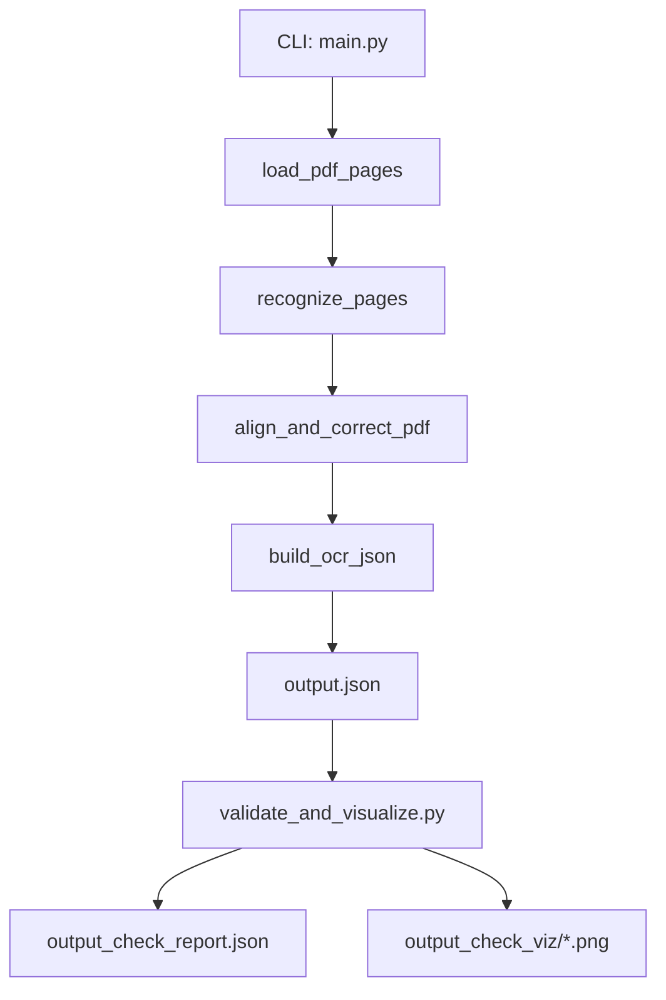
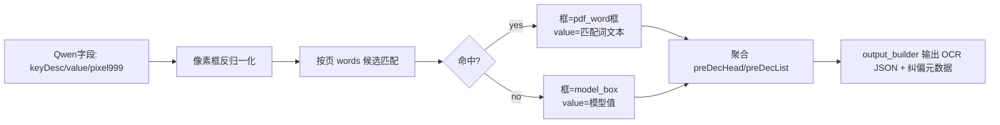

# `pdf_decl_pipeline_test` 处理流程与代码详解

## 1. 目标与定位
`jyk/pdf_decl_pipeline_test` 是一个面向 PDF 的“小测验流水线”，目标是：

- 将 PDF 按页转图，并确保每页图片边长不超过 `4096`
- 使用 Qwen3-VL 识别字段（`preDecHead/preDecList`）
- 用 PDF 原生 `words` 级文本坐标做交叉验证
- 将模型框纠偏为 PDF 源坐标映射框（命中时）
- 输出 OCR 兼容 JSON，并附纠偏元数据
- 提供校验+可视化脚本验证最终结果

适用场景：

- 版式相对规范、文本可提取（可拿到 words bbox）的 PDF
- 需要“模型识别结果 + 源文档坐标”联合校验的场景

当前边界：

- 单 PDF 输入（CLI 一次处理一个文件）
- 源坐标依赖 PyMuPDF（强依赖）
- 字段 schema 复用了 Excel 流水线的字段池与 prompt 规范

## 2. 目录与模块职责
核心目录：`d:/code/YiBao/jyk/pdf_decl_pipeline_test`

- [main.py](/d:/code/YiBao/jyk/pdf_decl_pipeline_test/main.py)：CLI、参数解析、总编排、API key 解析
- [pdf_loader.py](/d:/code/YiBao/jyk/pdf_decl_pipeline_test/pdf_loader.py)：PDF 按页渲染、`words` 坐标抽取、坐标映射
- [qwen_client.py](/d:/code/YiBao/jyk/pdf_decl_pipeline_test/qwen_client.py)：Qwen3-VL 并发识别与字段过滤
- [aligner.py](/d:/code/YiBao/jyk/pdf_decl_pipeline_test/aligner.py)：内容交叉验证、坐标纠偏、字段聚合
- [output_builder.py](/d:/code/YiBao/jyk/pdf_decl_pipeline_test/output_builder.py)：OCR 兼容 JSON 组装
- [models.py](/d:/code/YiBao/jyk/pdf_decl_pipeline_test/models.py)：数据模型定义
- [validate_and_visualize.py](/d:/code/YiBao/jyk/pdf_decl_pipeline_test/validate_and_visualize.py)：结果校验与可视化导出
- [requirements.txt](/d:/code/YiBao/jyk/pdf_decl_pipeline_test/requirements.txt)：依赖
- [tests/test_pipeline.py](/d:/code/YiBao/jyk/pdf_decl_pipeline_test/tests/test_pipeline.py)：核心单测

复用依赖模块：

- prompt 构造：`jyk.excel_decl_pipeline.prompt_adapter.generate_prompt`
- 字段池/映射：`jyk.excel_decl_pipeline.field_mapping_loader`
- 模型 JSON 清洗：`jyk.excel_decl_pipeline.json_utils.parse_and_validate`

## 3. 端到端处理流程（模块级）



文字调用链（不依赖 Mermaid）：

`main.parse_args`  
→ `main.run_pipeline_async`  
→ `pdf_loader.load_pdf_pages`  
→ `qwen_client.recognize_pages`  
→ `aligner.align_and_correct_pdf`  
→ `output_builder.build_ocr_json`  
→ 写出 `output.json`  
→ （可选）`validate_and_visualize.validate_and_visualize`

## 4. 核心数据模型（字段语义与流转）

定义文件：[models.py](/d:/code/YiBao/jyk/pdf_decl_pipeline_test/models.py)

### `PdfWordBox`
表示 PDF 源文本词级对象（映射到图片像素后）：

- `text`
- `x, y, width, height`（像素坐标）
- `page_index`
- `block_no, line_no, word_no`（用于行级/邻近词逻辑）

### `PdfPageModel`
表示单页处理单元：

- 页信息：`page_index`, `image_id`
- 图像信息：`image_path`, `image_data_url`, `image_width`, `image_height`
- PDF 物理信息：`pdf_rect`, `scale_x`, `scale_y`
- 源文本坐标：`word_boxes`

### `RecognizedField`
Qwen 对单字段的识别结果：

- `key_desc`, `key`, `value`
- `pixel`（归一化 `0-999`）
- `area`（`head/list`）
- `page_index`, `source_image_id`
- `model_row_index`（list 聚合辅助）

### `PageExtraction`
单页识别后结果容器：

- `pre_dec_head`
- `pre_dec_list`

## 5. 各阶段原理与代码详解

### 5.1 入口编排与参数（`main.py`）

关键函数：

- `_resolve_api_key`：[main.py](/d:/code/YiBao/jyk/pdf_decl_pipeline_test/main.py#L88)
- `run_pipeline_async`：[main.py](/d:/code/YiBao/jyk/pdf_decl_pipeline_test/main.py#L100)
- `parse_args`：[main.py](/d:/code/YiBao/jyk/pdf_decl_pipeline_test/main.py#L145)

输入：

- `--pdf_path`
- `--att_type_code`
- `--output_json`
- 可选 `--model --api_base_url --max_side --workers --dpi`

处理：

- 自动读环境变量与 `.env`
- 环境变量没有时，回退读取 `settings.py` 中 `API_KEY`
- 串接后续各模块并输出最终 JSON

输出：

- `output.json`
- `output_pages/`（页图产物目录）

异常行为：

- 缺 `pymupdf` 时，捕获 `ImportError` 并输出友好日志后退出（非 0）

### 5.2 PDF 按页渲染与 words 坐标映射（`pdf_loader.py`）

关键函数：

- `_ensure_fitz`：[pdf_loader.py](/d:/code/YiBao/jyk/pdf_decl_pipeline_test/pdf_loader.py#L24)
- `_compute_render_zoom`：[pdf_loader.py](/d:/code/YiBao/jyk/pdf_decl_pipeline_test/pdf_loader.py#L17)
- `load_pdf_pages`：[pdf_loader.py](/d:/code/YiBao/jyk/pdf_decl_pipeline_test/pdf_loader.py#L34)

输入：

- `pdf_path`
- `dpi`（默认 216）
- `max_side`（默认 4096）

处理原理：

1. 先按 `base_zoom = dpi/72` 渲染一次，拿到基准像素尺寸。
2. 若基准尺寸超过 `max_side`，按比例缩放 `zoom`，保证边长约束。
3. 逐页提取 `page.get_text("words")` 得到 PDF 点坐标。
4. 用 `scale_x/scale_y` 把 PDF 点坐标映射到图像像素坐标，形成 `PdfWordBox`。

输出：

- `List[PdfPageModel]`，每页包含图像路径、base64、尺寸、scale、word_boxes。

### 5.3 Qwen3-VL 并发识别与字段池过滤（`qwen_client.py`）

关键函数：

- `_recognize_single_page`：[qwen_client.py](/d:/code/YiBao/jyk/pdf_decl_pipeline_test/qwen_client.py#L59)
- `recognize_pages`：[qwen_client.py](/d:/code/YiBao/jyk/pdf_decl_pipeline_test/qwen_client.py#L127)

输入：

- 页图 `image_data_url`
- `prompt`（复用 `generate_prompt(att_type_code)`）
- 模型配置与并发配置

处理原理：

1. 调用 OpenAI-compatible 接口（DashScope）识别页图。
2. 通过 `parse_and_validate` 清洗模型输出 JSON。
3. `keyDesc -> key` 映射，非法字段过滤。
4. 根据 `att_type_code` 字段池做二次过滤（head/list 分别过滤）。
5. 保留 `pixel[0-999]` 与页维度信息。

输出：

- `List[PageExtraction]`

### 5.4 交叉验证与坐标纠偏（`aligner.py`）

关键函数：

- `normalize_text`：[aligner.py](/d:/code/YiBao/jyk/pdf_decl_pipeline_test/aligner.py#L19)
- `_model_bbox_to_page_bbox`：[aligner.py](/d:/code/YiBao/jyk/pdf_decl_pipeline_test/aligner.py#L33)
- `_match_word_candidates`：[aligner.py](/d:/code/YiBao/jyk/pdf_decl_pipeline_test/aligner.py#L63)
- `align_and_correct_pdf`：[aligner.py](/d:/code/YiBao/jyk/pdf_decl_pipeline_test/aligner.py#L143)
- `_aggregate_list`：[aligner.py](/d:/code/YiBao/jyk/pdf_decl_pipeline_test/aligner.py#L227)

匹配策略：

- `exact`：原文全等
- `normalized`：标准化后全等
- `weak`：包含关系
- `weak_union`：弱匹配命中且像长短语时，尝试同行多词并框
- `model_only`：无匹配，保留模型框

坐标纠偏策略：

- 命中词：`sourceType = pdf_word`，框改为词框/并框，`coordCorrected=true`
- 未命中：`sourceType = model_box`，框保持模型框，`coordCorrected=false`

行锚点与表体聚合：

- 优先使用匹配词的 `line_no` 作为锚点
- 无匹配时，按模型框纵向位置回退最近行锚
- `preDecList` 聚合优先 `codeTs` 的锚点，再回退最近锚点

### 5.5 OCR 兼容 JSON 输出（`output_builder.py`）

关键函数：

- `_transform_source`：[output_builder.py](/d:/code/YiBao/jyk/pdf_decl_pipeline_test/output_builder.py#L13)
- `_build_operate_image`：[output_builder.py](/d:/code/YiBao/jyk/pdf_decl_pipeline_test/output_builder.py#L52)
- `build_ocr_json`：[output_builder.py](/d:/code/YiBao/jyk/pdf_decl_pipeline_test/output_builder.py#L71)

输出结构：

- `content.preDecHead`
- `content.preDecList`
- `content.preDecContainer`
- `content.operateImage`

新增（纠偏元数据）：

- `pdfPage`
- `matchLevel`
- `coordCorrected`
- `sourceType`
- `lineAnchor`

`operateImage` 额外记录：

- `pdfDocPage`
- `pdfRect`
- `scaleX/scaleY`

### 5.6 校验与可视化（`validate_and_visualize.py`）

关键函数：

- `validate_and_visualize`：[validate_and_visualize.py](/d:/code/YiBao/jyk/pdf_decl_pipeline_test/validate_and_visualize.py#L242)
- `_extract_pdf_words`：[validate_and_visualize.py](/d:/code/YiBao/jyk/pdf_decl_pipeline_test/validate_and_visualize.py#L186)

校验规则（基础）：

- `imageId` 是否能映射到 `operateImage`
- 图片文件是否存在
- bbox 是否越界
- 宽高是否正数
- `coordCorrected=true + pdf_word` 时值为空会告警

可选 PDF 交叉（传 `--pdf_path`）：

- 再提取一次 PDF `words`
- 与输出框做重叠检查（overlap > 0.05）
- 重叠词文本与输出值做标准化匹配

可视化输出规则：

- `pdf_word` 常规通过：绿色框
- 有问题：橙色框
- `model_box`：蓝色框
- 标签：`keyDesc:value [matchLevel] [C/M]`
  - `C` = corrected
  - `M` = model_only

产物：

- `<output_stem>_check_viz/*.png`
- `<output_stem>_check_report.json`

## 6. 字段生命周期（Mermaid + 文字）



文字版：

`RecognizedField(pixel999)`  
→ `_model_bbox_to_page_bbox`  
→ `_match_word_candidates(exact/normalized/weak/weak_union)`  
→ 命中则替换框与值；未命中保留模型框  
→ `lineAnchor` 计算  
→ `preDecHead/preDecList` 聚合  
→ `build_ocr_json` 输出最终结构

## 7. 输入输出说明（实用视角）

输入（CLI）：

```bash
python -m jyk.pdf_decl_pipeline_test.main \
  --pdf_path "d:/code/YiBao/jyk/pdf_decl_pipeline_test/ED.pdf" \
  --att_type_code 4 \
  --output_json "d:/code/YiBao/jyk/pdf_decl_pipeline_test/output.json"
```

输出目录示例：

- `output.json`
- `output_pages/page_001.png ...`
- `output_check_viz/page_001_check.png ...`（可选校验脚本）
- `output_check_report.json`（可选校验脚本）

## 8. 常见报错与定位

### 1) `python main` 找不到文件
现象：`can't open file ...\main`  
原因：少写 `.py`。  
建议：`python main.py ...` 或 `python -m jyk.pdf_decl_pipeline_test.main ...`

### 2) 缺 `pymupdf`
现象：`PyMuPDF is required ...`  
原因：未安装依赖。  
建议：`pip install -r jyk/pdf_decl_pipeline_test/requirements.txt`

### 3) 缺 API Key
现象：`Missing API key...`  
原因：环境变量未生效。  
建议：设置 `DASHSCOPE_API_KEY` 或 `API_KEY`，或确认 `settings.py` fallback 可读。

### 4) 有些字段 `model_only`
现象：`coordCorrected=false`、`sourceType=model_box`。  
原因：源文本中未找到可匹配词（空值、OCR误读、跨词短语等）。  
建议：查看 `matchLevel`、可视化图、必要时调 `weak/weak_union` 策略。

### 5) 输出值与预期不同
现象：纠偏后值被替换成词文本。  
原因：当前命中时 `final_value=matched_word.text`。  
建议：如果要“值保留模型结果、只改框”，可改 `aligner._process_field` 逻辑。

## 9. 与现有测试产物对照（当前目录）

当前目录已有：

- [output.json](/d:/code/YiBao/jyk/pdf_decl_pipeline_test/output.json)
- [output_check_report.json](/d:/code/YiBao/jyk/pdf_decl_pipeline_test/output_check_report.json)
- `output_pages/`
- `output_check_viz/`

说明主链路和校验可视化链路都已跑通，可直接用于回归检查。

## 10. 维护建议（后续可选）

- 增加“严格模式”：`warnings>0` 也返回非 0 退出码（便于 CI）
- 增加“页内词聚合器”配置：控制 `weak_union` 激进程度
- 增加“值保留策略”开关：
  - `prefer_pdf_word_text`
  - `prefer_model_value`

## 11. 关键代码索引（快速跳转）

- [main.py](/d:/code/YiBao/jyk/pdf_decl_pipeline_test/main.py)
- [pdf_loader.py](/d:/code/YiBao/jyk/pdf_decl_pipeline_test/pdf_loader.py)
- [qwen_client.py](/d:/code/YiBao/jyk/pdf_decl_pipeline_test/qwen_client.py)
- [aligner.py](/d:/code/YiBao/jyk/pdf_decl_pipeline_test/aligner.py)
- [output_builder.py](/d:/code/YiBao/jyk/pdf_decl_pipeline_test/output_builder.py)
- [validate_and_visualize.py](/d:/code/YiBao/jyk/pdf_decl_pipeline_test/validate_and_visualize.py)
- [models.py](/d:/code/YiBao/jyk/pdf_decl_pipeline_test/models.py)
- [tests/test_pipeline.py](/d:/code/YiBao/jyk/pdf_decl_pipeline_test/tests/test_pipeline.py)

