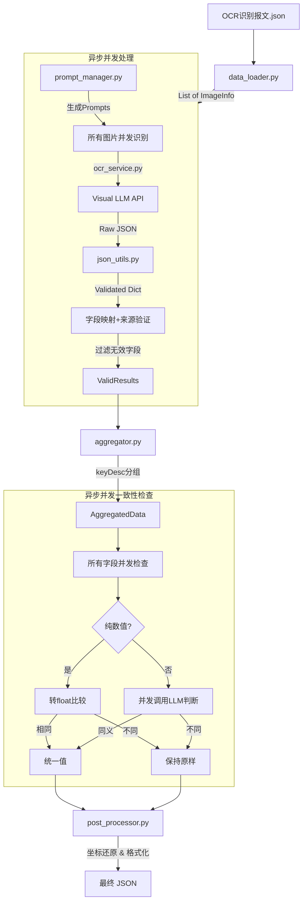

# 报关文档识别系统 - 代码框架设计文档（最终版）

## 1. 项目结构

```
customs_ocr/
├── config/
│   ├── __init__.py
│   ├── settings.py          # 全局配置（API Key, 模型配置, 重试次数等）
│   └── field_mapping.py     # 字段映射配置（模糊匹配+来源验证）
├── core/
│   ├── __init__.py
│   ├── models.py            # 数据模型定义
│   ├── data_loader.py       # 输入数据加载
│   ├── prompt_manager.py    # Prompt 模板管理
│   ├── ocr_service.py       # 视觉大模型服务（支持异步并发）
│   ├── json_utils.py        # JSON 校验与修复工具
│   ├── aggregator.py        # 多图内容聚合（支持异步并发）
│   └── post_processor.py    # 后处理（坐标转换、最终格式化）
├── main.py                  # 主程序入口（异步）
├── requirements.txt         # 依赖库
└── README.md               # 使用说明
```

## 2. 模块详细设计

### 2.1 数据模型 (`core/models.py`)

定义系统内部流转的数据结构。

*   **`ImageInfo`**: 存储单张图片的基本信息。
    *   字段: `image_id` (str), `image_url` (str), `att_type_code` (int), `width` (int), `height` (int)
*   **`ExtractedField`**: 存储从单张图片识别出的单个字段信息。
    *   字段: `key_desc` (str), `value` (str), `pixel` (List[int]), `image_id` (str)
*   **`ExtractionResult`**: 存储单张图片的完整识别结果。
    *   字段: `pre_dec_head` (List[ExtractedField]), `pre_dec_list` (List[List[ExtractedField]])
*   **`SourceItem`**: 存储来源信息。
    *   字段: `value`, `startx`, `starty`, `endx`, `endy`, `image_id`
*   **`AggregatedField`**: 聚合后的字段。
    *   字段: `key_desc`, `key`, `parsed_value`, `source_list`
*   **`FinalResult`**: 最终输出结果。
    *   字段: `pre_dec_head`, `pre_dec_list`

### 2.2 配置管理 (`config/`)

*   **`settings.py`**:
    *   `API_KEY`: 从环境变量获取（有默认值）
    *   `API_BASE_URL`: 大模型 API 地址
    *   `MODEL_NAME`: 视觉模型名称 ("qwen3-vl-flash")
    *   `TEXT_MODEL_NAME`: 文本模型名称 ("qwen-flash")
    *   `MAX_RETRIES`: JSON 修复和一致性检测的重试次数 (默认 3)
    *   `LOG_LEVEL`: 日志级别

*   **`field_mapping.py`**:
    *   `ATT_TYPE_NAMES`: 资料类型映射
    *   `KEY_DESC_TO_KEY`: 字典，映射中文 `keyDesc` 到英文 `key`（100+字段）
    *   `HEAD_FIELDS_BY_TYPE`: 各文件类型的表头字段定义
    *   `LIST_FIELDS_BY_TYPE`: 各文件类型的表体字段定义
    *   `KEY_TO_VALID_ATT_TYPES`: 反向映射，记录每个key的有效来源
    *   `fuzzy_match_key_desc()`: 模糊匹配函数（三级匹配策略）
    *   `is_valid_source()`: 来源验证函数

### 2.3 数据加载 (`core/data_loader.py`)

*   **`load_input_data(json_path: str) -> List[ImageInfo]`**
    *   **输入**: `OCR识别报文.json` 的文件路径
    *   **输出**: `ImageInfo` 对象列表
    *   **逻辑**: 读取 JSON，解析 `content.operateImage`，提取所需字段

### 2.4 Prompt 管理 (`core/prompt_manager.py`)

*   **`generate_prompt(att_type_code: str) -> str`**
    *   **输入**: 文件类别代码 `attTypeCode`
    *   **输出**: 完整的 Prompt 字符串
    *   **逻辑**: 根据 `attTypeCode` 从配置中获取对应的字段列表，填充到预定义的 Prompt 模板中

### 2.5 OCR 服务 (`core/ocr_service.py`)

*   **`recognize_images_batch(image_infos, prompts) -> List[ExtractionResult]`** ⭐ 异步批量识别
    *   **输入**: 图片信息列表，Prompt 列表
    *   **输出**: `ExtractionResult` 对象列表
    *   **逻辑**: 使用 `asyncio.gather()` 并发识别所有图片

*   **`recognize_image_async(image_info, prompt) -> ExtractionResult`** ⭐ 异步单图识别
    *   **输入**: 图片信息对象，Prompt 字符串
    *   **输出**: `ExtractionResult` 对象
    *   **逻辑**:
        1.  构造 API 请求消息
        2.  异步调用大模型 API
        3.  获取返回的文本内容
        4.  调用 `json_utils.parse_and_validate` 解析 JSON
        5.  如果解析失败，进行重试（最多 3 次）
        6.  **立即进行字段映射和来源验证**
        7.  **过滤掉无效字段**

*   **`convert_to_extraction_result(data, image_id, att_type_code)`**
    *   **新增参数**: `att_type_code` 用于来源验证
    *   **新增逻辑**:
        *   对每个字段调用 `fuzzy_match_key_desc()` 获取key
        *   调用 `is_valid_source()` 验证来源
        *   过滤掉key为空或来源无效的字段

### 2.6 JSON 工具 (`core/json_utils.py`)

*   **`parse_and_validate(json_str: str) -> Dict`**
    *   **输入**: 模型返回的原始字符串
    *   **输出**: 解析后的字典，如果失败则返回 None
    *   **逻辑**:
        1.  尝试直接 `json.loads`
        2.  如果失败，尝试去除 Markdown 标记 (```json ... ```)
        3.  尝试提取JSON部分
        4.  校验 JSON 结构是否包含 `preDecHead` 和 `preDecList`

### 2.7 聚合模块 (`core/aggregator.py`)

*   **`aggregate_results(results: List[ExtractionResult]) -> Dict`**
    *   **输入**: 所有图片的识别结果列表（已过滤和映射）
    *   **输出**: 聚合后的中间结构字典
    *   **逻辑**:
        1.  **Head 聚合**: 按 `keyDesc` 分组，合并 `sourceList`，补充key
        2.  **List 聚合**: 按商品顺序聚合，补充key

*   **`check_consistency_and_unify_async(aggregated_data) -> Dict`** ⭐ 异步一致性检查
    *   **输入**: 聚合后的数据
    *   **输出**: 处理后的数据
    *   **逻辑**:
        1.  收集所有需要检查的字段
        2.  使用 `asyncio.gather()` 并发处理所有字段
        3.  对每个字段调用 `unify_source_list_async()`

*   **`unify_source_list_async(source_list)`** ⭐ 异步统一字段值
    *   **逻辑**:
        1.  检测值是否一致
        2.  如果不一致，调用 `call_llm_to_judge_consistency_async()`

*   **`call_llm_to_judge_consistency_async(values)`** ⭐ 异步语义判断
    *   **优化逻辑**:
        1.  **数值判断优先**: 如果都是数值，转换为float比较
            *   相同：统一为第一个值的格式
            *   不同：直接返回不一致，不调用大模型
        2.  **非数值**: 异步调用 qwen-flash 模型判断语义
        3.  **容错**: JSON解析失败自动重试

*   **`is_numeric(value: str) -> bool`**
    *   判断字符串是否为纯数值（支持千分位、小数）

### 2.8 后处理 (`core/post_processor.py`)

*   **`process_final_output(aggregated_data: Dict, image_infos: List[ImageInfo]) -> Dict`**
    *   **输入**: 聚合后的数据（已包含key），图片信息列表
    *   **输出**: 最终符合需求的 JSON 字典
    *   **逻辑**:
        1.  **生成 `parsedValue`**: 取 `sourceList` 第一个值
        2.  **坐标转换**:
            *   遍历 `sourceList` 中的 `pixel`
            *   根据 `image_id` 找到对应的 `ImageInfo`
            *   将归一化坐标 [0-999] 转换为原图绝对坐标
        3.  组装最终 JSON 结构

## 3. 核心改进点

### 3.1 异步并发架构 ⭐

```python
# 图片识别并发
results = await recognize_images_batch(image_infos, prompts)

# 值一致性判断并发
await check_consistency_and_unify_async(aggregated_data)
```

**优势**:
- 5张图片识别从 5×响应时间 → 1×响应时间
- 50个字段值判断从 50×响应时间 → 1×响应时间
- 总体提速：10-50倍

### 3.2 双模型策略 ⭐

- **qwen3-vl-flash**: 图片识别（视觉能力）
- **qwen-flash**: 文本判断（速度更快、成本更低）

### 3.3 提前验证机制 ⭐

在OCR识别阶段即刻：
1. 字段名称模糊匹配
2. 来源有效性验证
3. 过滤无效字段

**优势**: 减少后续处理负担，提高数据准确性

### 3.4 智能值比较 ⭐

```python
# 数值字段：转换后比较
"789.90" == "789.9" → True（统一）

# 非数值字段：大模型判断
"USA" vs "美国" → 调用大模型判断
```

**优势**: 避免不必要的大模型调用，提升性能

### 3.5 三级模糊匹配 ⭐

1. **精确匹配**: 直接查找字典
2. **去空格匹配**: 去除空格和特殊字符后匹配
3. **部分匹配**: 基于包含关系的模糊匹配

**示例**:
- `"毛重（千克）"` → `grossWt`
- `"发票号 NO."` → `licenseNo`
- `"贸易国（地区）"` → `cusTradeNationCode`

## 4. 数据流图 (Mermaid)



## 5. 核心算法

### 5.1 字段来源验证算法

```python
def is_valid_source(key: str, att_type_code: int, field_type: str) -> bool:
    """
    例如：净重(netWt)只能从预录入单(4)和装箱单(3)的表头识别
    如果在发票(2)中识别到净重，会被过滤掉
    """
    if key not in KEY_TO_VALID_ATT_TYPES:
        return False
    return att_type_code in KEY_TO_VALID_ATT_TYPES[key][field_type]
```

### 5.2 数值智能比较算法

```python
# 转换为数值
"789.90" → 789.9
"789.9"  → 789.9
"1,234"  → 1234.0

# 比较float值
789.9 == 789.9 → True（统一为"789.90"）
```

### 5.3 异步并发算法

```python
# 图片识别并发
tasks = [recognize_image_async(img, prompt) for img, prompt in zip(images, prompts)]
results = await asyncio.gather(*tasks)

# 值判断并发
tasks = [unify_source_list_async(field) for field in all_fields]
await asyncio.gather(*tasks)
```

## 6. 字段映射规则

### 6.1 表头字段示例

| 中文字段名 | 英文key | 有效来源文件类型 |
|-----------|---------|----------------|
| 净重 | netWt | 4(预录入单), 3(装箱单) |
| 境内收发货人名称 | consigneeCname | 1,2,3,4,5,14 |
| 主运单号 | mainBillNo | 19(空运运单) |

### 6.2 表体字段示例

| 中文字段名 | 英文key | 有效来源文件类型 |
|-----------|---------|----------------|
| 商品名称 | gName | 1,2,3,4,5,14 |
| 原产国 | cusOriginCountry | 4(预录入单) |
| 柜号 | containerNo | 1,2,3,4,5 |

## 7. 性能优化策略

### 7.1 并发控制
- 图片识别：无限制并发（由API限流控制）
- 值判断：无限制并发（可根据需要添加信号量）

### 7.2 智能缓存
- 数值比较：直接计算，无需调用API
- 相同值：跳过一致性检查

### 7.3 早期过滤
- OCR阶段即刻过滤无效字段
- 减少聚合和后处理的数据量

## 8. 错误处理

### 8.1 OCR识别阶段
- 单图失败不影响其他图片
- 自动重试机制（最多3次）
- 异常捕获并记录

### 8.2 值一致性判断阶段
- 单字段判断失败不影响其他字段
- 数值比较失败时使用大模型兜底
- 大模型调用失败时保持原值

### 8.3 日志记录
- INFO: 关键步骤和成功信息
- WARNING: 字段过滤、值不一致等
- ERROR: 识别失败、解析失败等
- DEBUG: 详细的API响应内容

## 9. 扩展方向

### 9.1 并发控制
```python
# 添加信号量限制并发数
semaphore = asyncio.Semaphore(10)
async with semaphore:
    await recognize_image_async(...)
```

### 9.2 结果缓存
```python
# 缓存识别结果，避免重复识别
cache = {}
if image_url in cache:
    return cache[image_url]
```

### 9.3 进度监控
```python
# 添加进度条
from tqdm.asyncio import tqdm
results = await tqdm.gather(*tasks)
```

## 10. 依赖说明

```
openai>=1.0.0          # OpenAI API客户端（支持AsyncOpenAI）
requests>=2.31.0       # HTTP请求库
pillow>=10.0.0         # 图片处理
python-dotenv>=1.0.0   # 环境变量管理
asyncio                # 异步支持（Python标准库）
aiohttp>=3.8.0         # 异步HTTP客户端
```

## 11. 使用示例

### 11.1 基本使用
```bash
cd customs_ocr
python main.py
```

### 11.2 指定路径
```bash
python main.py ../input.json ./output.json
```

### 11.3 环境变量配置
```bash
export API_KEY="your-api-key"
python main.py
```

## 12. 测试建议

### 12.1 单元测试
- 测试字段模糊匹配
- 测试数值比较逻辑
- 测试来源验证

### 12.2 集成测试
- 测试完整流程
- 测试异常处理
- 测试并发性能

### 12.3 性能测试
- 对比串行vs并发的执行时间
- 测试不同并发数的影响
- 监控API调用次数

## 13. 版本历史

### v2.0 (当前版本)
- ✅ 异步并发架构
- ✅ 双模型策略
- ✅ 提前验证机制
- ✅ 智能值比较
- ✅ 三级模糊匹配

### v1.0 (初始版本)
- ✅ 基础串行处理
- ✅ 字段识别和聚合
- ✅ 坐标转换
